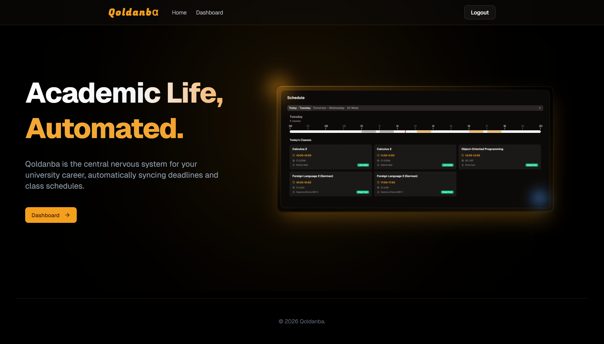

# Arlan Portfolio

Personal portfolio for Alibay Arlan Akhanuly, built with Next.js, React, TypeScript, Tailwind CSS, and shadcn-style UI primitives.

Live site:

```txt
https://arlan-6.github.io/
```

## Features

- Responsive single-page portfolio
- Profile sidebar with contacts, social links, skills, and languages
- Education and project sections
- Expandable project details with GitHub links
- Interactive bottom contact section for Telegram/email messages
- Static export configured for GitHub Pages

## Development

Install dependencies:

```bash
npm install
```

Run the local dev server:

```bash
npm run dev
```

Open:

```txt
http://localhost:3000
```

## Useful Commands

Type-check:

```bash
npx tsc --noEmit
```

Lint:

```bash
npm run lint
```

Build static export:

```bash
npm run build
```

The static site is generated into the `out/` directory.

## Project Structure

```txt
app/                         Next.js app entry
components/portfolio/        Portfolio sections and layout components
components/ui/               Shared UI primitives
lib/cv-data.ts               Portfolio content and CV data
.github/workflows/deploy.yml GitHub Pages deployment workflow
```

## Deployment

This repository is configured for GitHub Pages as a user site:

```txt
arlan-6.github.io
```

Deployment runs automatically through `.github/workflows/nextjs.yml` when changes are pushed to `master`.

To deploy:

```bash
git add .
git commit -m "Update portfolio"
git push origin master
```

In GitHub repository settings, set:

```txt
Settings -> Pages -> Source -> GitHub Actions
```

After the workflow succeeds, the site is available at:

```txt
https://arlan-6.github.io/
```

## Problem, architecture, and contribution

This portfolio gives recruiters a single place to inspect education, technical work, source code, and a downloadable CV. `lib/cv-data.ts` supplies the portfolio and `/cv/` page. `lib/site-config.ts` supplies metadata. Components in `components/portfolio/` render each section; the home page owns navigation, scroll progress, and email-copy state. Next.js exports static HTML and assets to GitHub Pages, without a runtime backend.

The portfolio documents Alibay Arlan's application development, authentication, database integration, and deployment work. Each project links to source code and explains its problem, solution, contribution, and learning outcomes.



## Regenerating the CV

The downloadable PDF is a committed artifact, not regenerated by the site build. After changing CV content, run the dev server, then in another PowerShell terminal:

```powershell
./scripts/export-cv.ps1
```

This prints the local `/cv/` page using headless Microsoft Edge. Pass `-BrowserPath` to use another Chromium executable, or `-Url` for a server on another port. Inspect the PDF for a single A4 page, readable text, and working links before committing it alongside the source change. The public portfolio omits the phone contact; the downloadable application CV retains it.

## Limitations and next improvements

- The PDF must be regenerated when CV source changes.
- Coursework, academic ranking, project metrics, and personal contributions require evidence before publication.
- A data/ML or networking project should be featured only after its implementation and results are reviewable.
- No automated test suite is configured. Use lint, type-checking, a production build, and desktop/mobile visual checks for site changes.
- The two featured repositories now document setup and technical limitations: [Qoldanba](https://github.com/arlan-6/qoldanba) and [Shaqr](https://github.com/arlan-6/invites).
